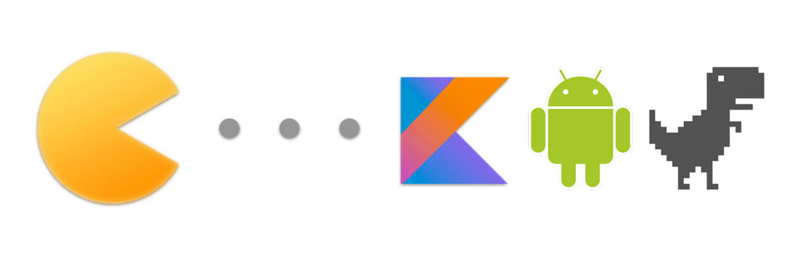

# Koin_doc_zh

Koin_doc_zh 是对 [Koin](https://github.com/InsertKoinIO/koin) 项目 [Koin使用文档](https://doc.insert-koin.io/#/setup/index) 的中文翻译。

- [在线阅读](https://andyjennifer.com/AndyJennifer.github.io-Koin_Doc_Zh)

## Koin 是什么

KOIN 是一个面向 Kotlin 开发人员的实用的轻量级依赖注入框架。用纯 Kotlin 编写，只使用函数解析:没有代理，没有代码生成，没有反射。

`Koin 是一个 DSL、一个轻量级容器和一个实用的 API`。

## 目录

* [Introduction](README.md)
* [Intro](/KOIN/Intro.md)
* [Setup](/KOIN/Setup.md)
* [KOIN CORE](README.md)
  * [Koin DSL](KOIN/Part1/01-Koin_DSL.md)
  * [Definitations](KOIN/Part1/02-Definitaions.md)
  * [Modules](KOIN/Part1/03-Modules.md)
  * [Start Koin](KOIN/Part1/04-Start_Koin.md)
  * [Koin Component](KOIN/Part1/05-Koin_Component.md)
  * [Injecting Parameters](KOIN/Part1/06-Injecting_Parameters.md)
  * [Setters Injection](KOIN/Part1/07-Setters_Injection.md)
  * [Scope API](KOIN/Part1/08-Scope_API.md)
  * [Using Java](KOIN/Part1/09-Using_Java.md)
  * [Logging](KOIN/Part1/10-Logging.md)
  * [Properties](KOIN/Part1/11-Properties.md)
  * [Experimental Features](KOIN/Part1/12-Experimental_Features.md)
* [KOIN TEST](README.md)
  * [Junit & Mocks](KOIN/Part2/1-Junit&Mocks.md)
* [KOIN ANDROID](README.md)
  * [Start on Android](KOIN/Part3/1-Start_on_Android.md)
  * [Android DSL](KOIN/Part3/2-Android_DSL.md)
  * [Retrieve Instances](KOIN/Part3/3-Retrieve_Instances.md)
  * [Koin Scope](KOIN/Part3/4-Koin_Scope.md)
  * [ViweModel](KOIN/Part3/5-ViewModel.md)
  * [Fragment Factory](KOIN/Part3/6-Fragment_Factory.md)
* [KOTIN KTOR](README.md)
  * [Injecting with Ktor](KOIN/Part4/1-Injecting_with_Ktor.md)

## 报告问题 🛠

因为作者水平与能力有限，难免会翻译错误，如果你发现翻译错误， 请一定要在 Github上 提一个 [Issue](https://github.com/AndyJennifer/koin_doc_zh/issues)。Thanks~❤️
